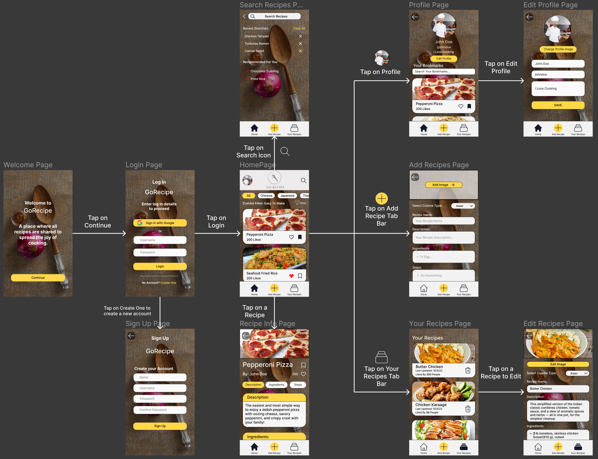
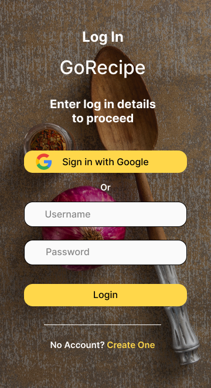
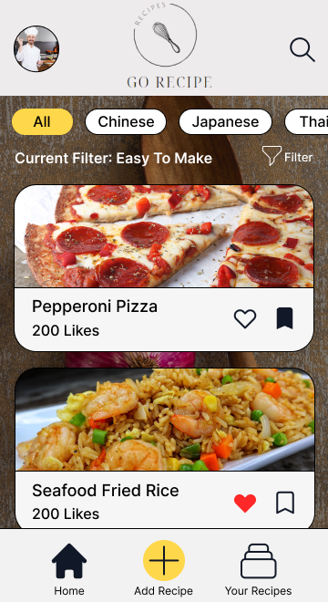
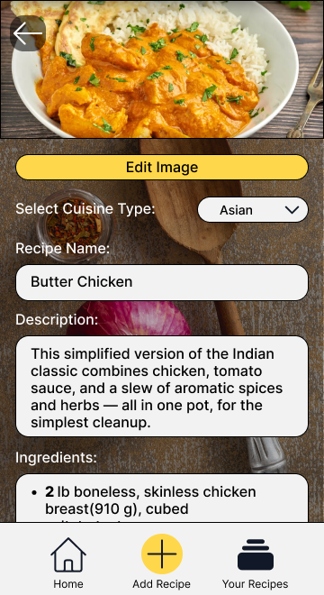
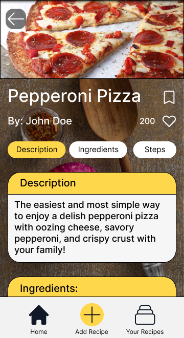
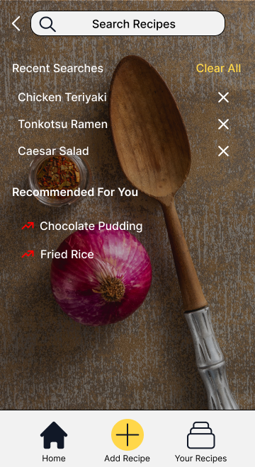
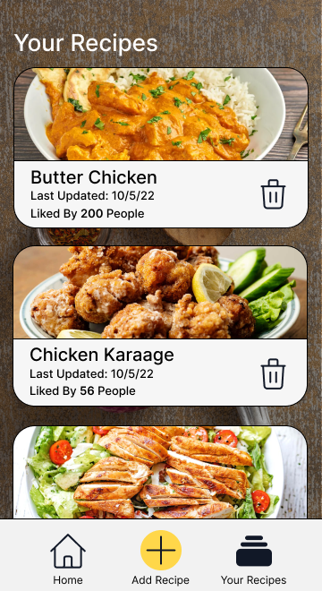
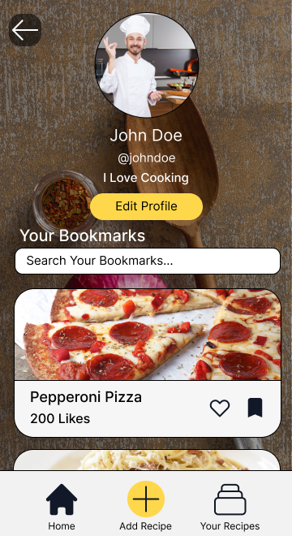

# GoRecipe

## A Recipe App to allow users to share recipes from their hometown or their childhood. This app allows users to view, add, edit and delete recipes. Includes a search page UI, that allows users to search directly without having to look through the homepage, there is also a profile page to allow users to keep track of their bookmarked recipes for them to refer to easily when they need it.

```
1. Edit the IP Address in the public folder -> utils -> IPAddress.js to your local IP Address.
    > (This is the IP Address of the wifi that your computer is connected to)

2. Open 2 terminal tabs and CD into the public and server folders respectively.

3. Run -> "npx expo start" in the public folder terminal and "nodemon server.js" in the server folder terminal
```

# UI Flow of the application.



# Snippets of how the application looks.

## Login Page:



## Home Page:



## Edit Recipe Page:



## Recipe Info Page:



## Search Recipes Page:



## Your Recipes Page:



## Profile Page:


